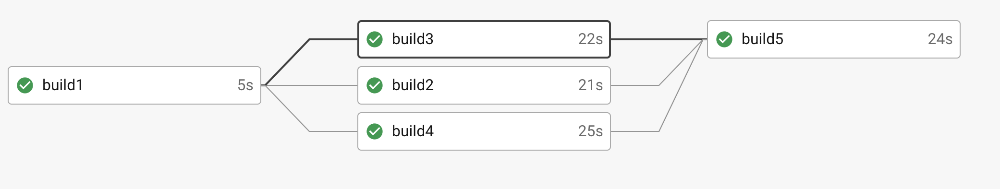

## Fanin/fanout configuration with approval of build 

## paste in `config.yml`
<br/>

```
version: 2

jobs: 
  build1:
    docker: 
      - image: 'cimg/python:3.6'
    steps:
      - checkout
      - run: echo "hello junip"  
  build2:
    docker:
      - image: 'cimg/python:3.6'      
    steps:
      - checkout
      - run:
          name: "second build command"
          command: |
            echo "second build"
            echo "second build"
  build3:
    docker:
      - image: 'cimg/python:3.6'      
    steps:
      - checkout
      - run:
          name: "third build command"
          command: |
            echo "third build running"
            echo "third build message printed"
  build4:
    docker:
      - image: 'cimg/python:3.6'      
    steps:
      - checkout
      - run:
          name: "fourth build command"
          command: |
            echo "fourth build running"
            echo "fourth build message printed"   
  build5:
    docker:
      - image: 'cimg/python:3.6'      
    steps:
      - checkout
      - run:
          name: "fifth build command"
          command: |
            echo "fifth build running"
            echo "fifth build message printed"          
            
        

workflows:
  version: 2
  test_and_deploy: 
    jobs:
      - build1
      - build2: 
          requires: 
            - build1
      - build3: 
          requires: 
            - build1
      - build4: 
          requires: 
            - build1
      - build5: 
          type: approval  // this will create build paused. once its approved build will run 
          requires: 
            - build2
            - build3
            - build4
            
```


### without the `type: approval` the `build5` will automatically execute.

