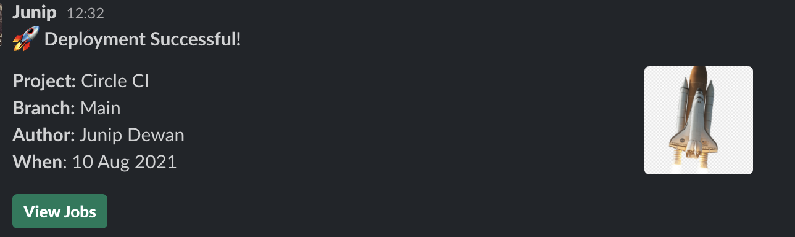

### Custom Successful Deployment Template.
- Paste in  your slack integration in config.yml file.
- your slack channel will be notified like this.

<br/>



<br/>
<br/>

```
 - slack/notify:
          channel: your channel
          event: pass
          custom: |
            // your code goes here
```

```json
{ 
  "text": "CircleCI job succeeded!",
  "blocks": [
    {
      "type": "section",
      "text": {
        "type": "mrkdwn",
        "text": "*:rocket: Deployment Successful!*"
      }
    },
    {
      "type": "section",
      "fields": [
        {
          "type": "mrkdwn",
          "text": "*Project*: \n $CIRCLE_PROJECT_REPONAME"
        },
        {
          "type": "mrkdwn",
          "text": "*Branch*: \n $CIRCLE_BRANCH"
        },
        {
          "type": "mrkdwn",
          "text": "*Commit*: \n $CIRCLE_SHA1"
        },
        {
          "type": "mrkdwn",
          "text": "*Author*: \n $CIRCLE_USERNAME"
        }
      ],
      "accessory": {
        "type": "image",
        "image_url": "https://w7.pngwing.com/pngs/814/561/png-transparent-brown-and-white-rocket-illustration-kennedy-space-center-space-shuttle-program-sts-129-international-space-station-space-shuttle-atlantis-rockets-spacecraft-rocket-launch-nasa.png",
        "alt_text": "CircleCI logo"
      }
    },
    {
      "type": "actions",
      "elements": [
        {
          "type": "button",
          "text": {
            "type": "plain_text",
            "text": "View Job"
          },
          "url": "${CIRCLE_BUILD_URL}"
        }
      ]
    }
  ]
}
```